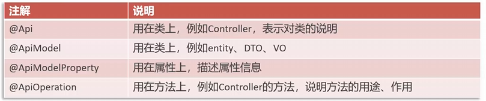
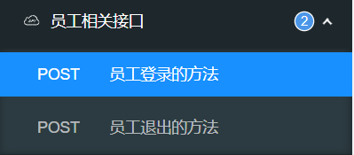
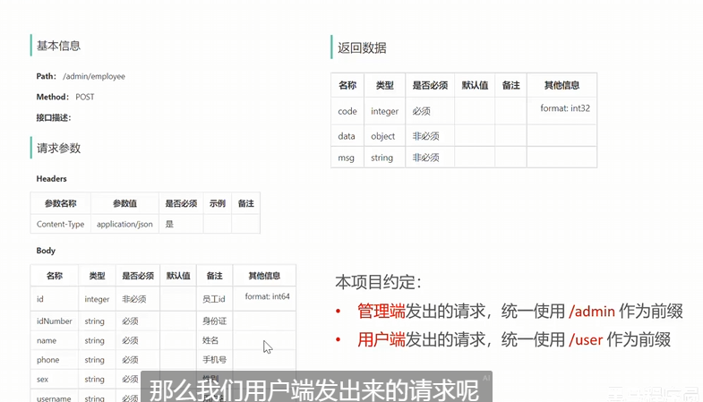

skytakeout
员工登录逻辑
生成TOKEN的形式
登录进入controller
public Result<EmployeeLoginVO> login(@RequestBody EmployeeLoginDTO employeeLoginDTO)
前端传送的数据存在EDTO中

调用service层的login方法
接着在项目定义的token生成的方式Hs256
从application.yml中取得需要的数据，作为参数

接着需要将数据封装成 员工登录返回的数据格式
（包含id name username jwt令牌 ）
然后通过Result.sucess将员工返回的数据格式传入返回
登录结束

后端环境搭建-前后端联调
nginx反向代理的好处：
在 Nginx 中启用缓存可以显著减少对后端服务器的请求次数。
通过在 Nginx 配置中设置缓存(通常都是静态资源)
可以将经常请求的资源保存在缓存中，从而提高访问速度。

负载均衡：，就是把大量的请求按照我们指
定的方式均衡的分配给集群中的每台服务器

容错：
高可用性和负载均衡： Nginx 支持负载均衡功能，可以将请求分发到多个后端服务器， 从而提高系统的可用性和容错性。
即使某个后端服务器发生故障，Nginx 也可以将请求转发给其他健康的服务器，避免单点故障。

动态配置和运维： Nginx 具有灵活的配置文件和动态重载功能，可以在不重启服务的情况下实时修改配置，
从而降低系统维护的风险和影响。

正向代理和反向代理：
正向：用户发送请求->nginx->后端
后端->nginx->用户
正向代理隐藏了客户端的真实IP地址，目标服务器只能看到代理服务器的IP地址，
因此可以用于突破访问限制或保护客户端的隐私。
反向：
客户端只知道请求和响应来自于代理服务器，不知道目标服务器的存在。
保证后端服务的安全
nginx负载均衡如何实现以及如何配置

# Swagger

注解 说明
@Api
用在类上，例如Controller,
表示对类的说明
@ApiModel
用在类上，例如entity、DTo、VO
@ApiModelProperty
用在属性上，描述属性信息
@ApiOperation
用在方法上，例如Controller的方法，说明方法的用途、作用

会在swagger上得到提体现

# 代码开发新增员工

代码开发
自己写